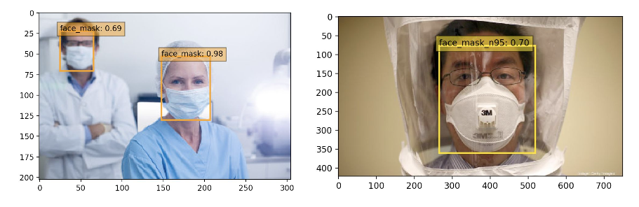

# Face Mask & N95 Mask Detector
This project implements an SSD network to detect human faces, faces with regular clinical masks, and faces with N95 masks. 

The poster presentation can be accessed at [Poster Session](https://github.com/im-daniel-wang/MaskOn-Clinical-and-N95-Mask-Detector/blob/master/mask_on_poster.pdf)

Prediction Example


To try it using your own images:
- Create a folder called "my_img" from the source directory
- put the image inside my_img/, and run the following command from the root folder:
```
python demo.py
```